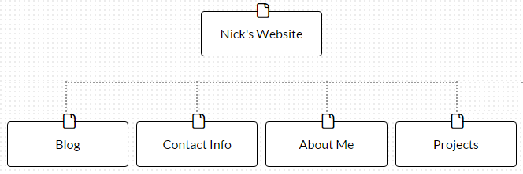

1. What are the 6 Phases of Web Design?
Information gathering
Planning
Design
Development
Testing and delivery
Maintenance
Saying that these are the 6 phases of design is a bit misleading because this includes "Design" as one of the phases. The full list was called "Six phases of design and development" which is also a bit awkward...

What is your site's primary goal or purpose? What kind of content will your site feature?
Ok, doing some information gathering here... My website should include my photo, my contact info, my blog, a little about myself (with links to social media), and my projects. More content could be added later.

What is your target audience's interests and how do you see your site addressing them?
I see this site as a way for my peers and prospective employers to get a good sense of who I am, and what neat things I can do. As such it is basically to promote me.

What is the primary "action" the user should take when coming to your site? Do you want them to search for information, contact you, or see your portfolio? It's ok to have several actions at once, or different actions for different kinds of visitors.
I could see different users looking for information in a different order. Some might check out my projects first, and then contact me through social media, or use my contact info to get a hold of me. Others might be looking for info about me as a person, and might not be interested in my projects. Similarly they might follow me on social media or contact me directly. Ultimately a "conversion" would be someone who does reach out to me with an opportunity or project they want to collaborate on.

What are the main things someone should know about design and user experience?
In terms of the process, it's important to start with purpose--what the site needs to do, or what the user needs to be able to do. That should motivate things like layout and how many different types of pages to have. 
Whereas jumping ahead to looking at sites that have perform similar functions or have appealing elements would start to prematurely form a checklist of things that will be expected of the new site that shouldn't be.
So it is important to go through the phases of design in sequence rather than trying to jump around.

In terms of visual design, keeping it as simple as possible, in things like color, font, content (text>images>video) makes for the most reliable user experience, and also helps with things like brand recognition, performance, adaptation to screen-reading or translation, etc. And makes for a more seamless transition to smaller screens.

What is user experience design and why is it valuable? 

User experience design is focuses on seeing the project in terms of what a user would want to get out of it, and what it would be like for them to try to do that. Often this can be in terms of a narrative. It can also be measured on a statistical level, by looking at what percentage of users click through to another page, or take some action (like buying a product) that is the mutual goal of the client and the user. Once a site is live, user experience testing can be done in parallel with the existing site by splitting the traffic to an alternative design, and measuring its success. 

User experience should be a part of the design process as much as possible. In the absence of actual user experience testing, the designers and the clients will evaluate the site based on their own experience, which is valid, but maybe not representative of the average target user.

Which parts of the challenge did you find tedious?

I didn't. Design is something that I find really interesting!