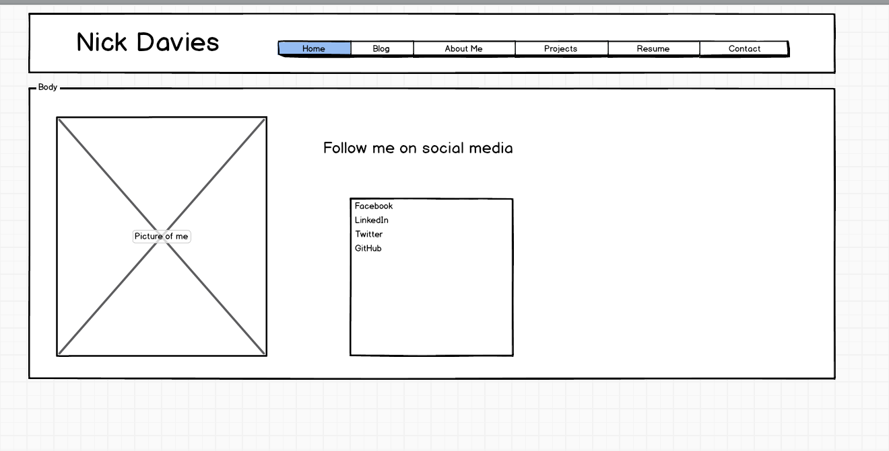
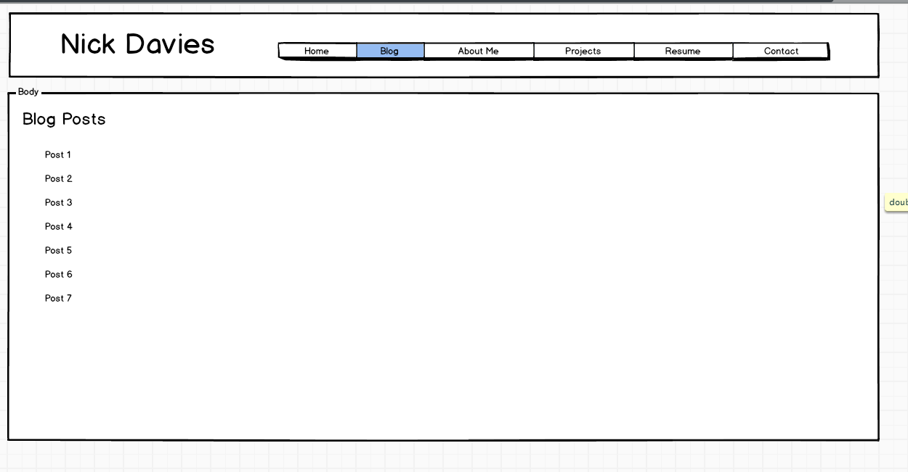

What is a wireframe?

A wireframe shows the layout of, and potentially the user interaction with, a site before the design is fully rendered or coded. This allows you to evaluate in the abstract whether it will work as needed without getting mired in aesthetic decisions like color or font. It's something you could sketch out with pen and paper, or generate on the computer, either using a dedicated tool, or using any software that gives you control of the visual layout of elements on screen.

What are the benefits of wireframing?

It helps everyone agree on the large-scale structure of the site before any coding has begun, and redraft the design much more easily than rewriting the entire website later. 

Did you enjoy wireframing your site?

It's fun! For this exercise, there isn't really a lot information to fit onto a page, so the challenge is more about how to handle the negative space left over.

Did you revise your wireframe or stick with your first idea?

I had a general idea of the layout I was going for (nothing crazy), but in wireframing you can nudge things around until they look natural.

What questions did you ask during this challenge? What resources did you find to help you answer them?

I checked out some of the wireframing tools, and decided to try out Balsamiq's online app, since it was widely recommended. There were some tools out there that I would be interested to try at some point. I could have done the wireframing on paper or in an image editor (like gimp), but doing it that way seems like it could be unnecessarily fiddly compared to using a dedicated tool.

Which parts of the challenge did you enjoy and which parts did you find tedious?

It was fun. I'm not sure I got everything there is to get out of the "Beyond Wireframing" link. I may need to come back to it after I learn more about UX design.