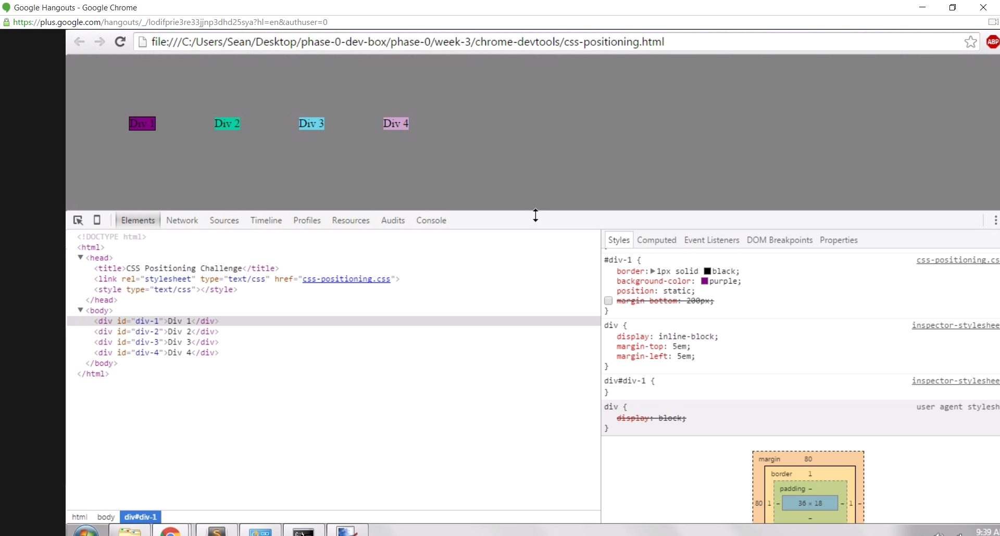

How can you use Chrome's DevTools inspector to help you format or position elements?

You can see what parts of the HTML and CSS code are making an element look the way it does, but it also allows you to change values and add parameters on the fly, to guess and check very quickly, without having to edit your file, save the file, and reload the page repeatedly. 

How can you resize elements on the DOM using CSS?

You can edit or add CSS values for height, width, padding, margins, etc.

What are the differences between absolute, fixed, static, and relative positioning? Which did you find easiest to use? 

Fixed and absolute I think are the most straightforward to me. Absolute allows you to position an element within its parent element, but you get to essentially ignore its sibling elements when doing so. Fixed allows you to position an element in terms of the screen itself, ignoring sibling elements and parent elements and scrolling. So those are straightforward to control if you know exactly where you want your element to go. 

Static and relative are more dependent on the other elements on the page, which can be more useful if you want to make sure things don't overlap and that they're arranged in particular ways even if elements are added or removed from the page. Static just means that the element will go where it's meant to by default. So that's simple to control in a different way. Relative starts with that default position and then you can move it from there. This seems riskier, because you're then leaving a gap where the element "should have been", and moving it somewhere else relative to that position.

Which was most difficult?

I don't think we got too bogged down in anything, but where we did have to research a bit more was with the header, footer, and sidebar exercises. I think it took me a little while to realize that to get the sidebar to start at the top of the screen (rather than below the other elements), I had to add top:0. For the header, we hunted for a way to center it, and ended up using left:25%, which didn't seem like the ideal solution, but definitely got it done.

What are the differences between margin, border, and padding?

Padding is the distance between what's inside the element (text, picture, whatever) and the element border. Then there's the border itself, which can have its own thickness, color, pattern, etc. Then outside the border, the margin is the amount of space between the current element and elements around it. These can all be defined for the element's entire perimeter, or for each side (top, bottom, left, right).

What was your impression of this challenge overall? (love, hate, and why?)

I thought it was really fun! I'm not super proud of what we did with the freeform section, but I didn't have any particular goal in mind.
