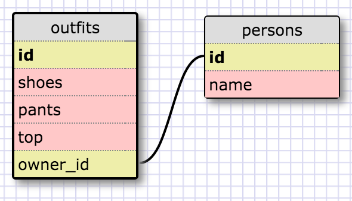

1. SELECT * FROM states;
2. SELECT * FROM regions;
3. SELECT state_name,population FROM states;
4. SELECT state_name,population FROM states ORDER BY population DESC;
5. SELECT state_name FROM states WHERE region_id = 7;
6. SELECT state_name,population_density FROM states WHERE population_density > 50 ORDER BY population_density ASC;
7. SELECT state_name FROM states WHERE population BETWEEN 1000000 AND 1500000;
8. SELECT state_name,region_id FROM states ORDER BY region_id;
9. SELECT region_name FROM regions WHERE region_name LIKE '%central%';
10. SELECT regions.region_name,states.state_name FROM states INNER JOIN regions ON states.region_id=regions.id ORDER BY regions.id ASC;

What are databases for?
Databases are for arranging information into a logical system to allow you to access and extract it later.

What is a one-to-many relationship?
This would be any situation in which one thing can be related to some number of another thing. Like people and cats--one person can have one cat, another person can have zero cats, but because a person can also have multiple cats, the relationship between people and cats is considered one-to-many to account for that possibility.

What is a primary key? What is a foreign key? How can you determine which is which?
The primary key of a table is the column that defines each row as unique. So if you have more than one row with the same primary key, those are duplicate rows and ought to be combined.

How can you select information out of a SQL database? What are some general guidelines for that?
The general outline of it is: SELECT column(s) FROM table(s) WHERE (row criteria)
For the columns, you can display columns as they are, or you can perform operations like counting or averaging to create new columns off of the stored data. For the tables part, you can pull information from one table, or you can join tables together to create a "frankentable" and pull information from that. For the row criteria, you can use typical boolean operators, you can control what order the rows are returned in, and you can combine rows together (using GROUP BY).