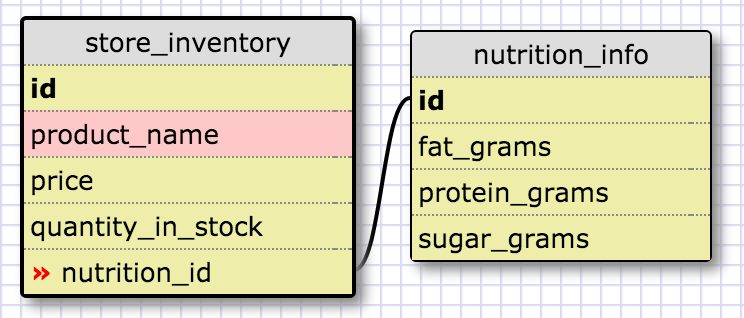
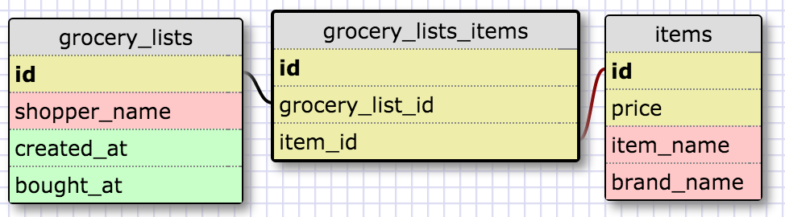

One-to-one schema:

This is a one-to-one relationship because each product in your store will have at most one set of nutrition info. Things like lightbulbs and trashbags wouldn't have any. It also makes sense to keep the nutrition info in a separate table, in case you had more than one store stocking the same items, or if you delete the row from the store inventory when you run out of an item. 

Many-to-many schema:

What is a one-to-one database?
This is a relationship between two tables where there is at most one row in the second table for every row in the first table. 

When would you use a one-to-one database? (Think generally, not in terms of the example you created).
It was a bit challenging trying to think of things that in exact pairs (one A for every B). Like spouses, I suppose, but since both spouses are people, it's hard to say which spouse should be in table A and which spouse should be in table B. But you can also use a one-to-one database even if you have tables that refer to the same thing but shouldn't be in the same table. Like a person's academic record vs. their athletic record.

What is a many-to-many database?
This would be a relationship between tables where one row in table A could correspond to multiple rows in table B, and vice versa. So there typically has to be a table in the middle just to keep track of that relationship, so that neither of the other tables has to have duplicate rows.

When would you use a many-to-many database? (Think generally, not in terms of the example you created). 
There are a lot of situations where there is a many-to-many relationship between data sets. Like cats or cars, one person can have multiple, or multiple people can jointly own a cat. Multiple actors appear in a single movie, and a single actor can appear in multiple movies. Basically anytime you can't say "there's only one A for every B" or "there's only one B for every A", then you have a many-to-many database.

What is confusing about database schemas? What makes sense?
I think it generally makes sense in theory. Of course things get more complicated when you try to apply these schemas out in the real world. 